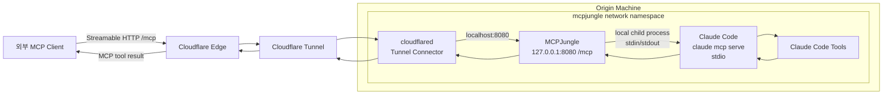
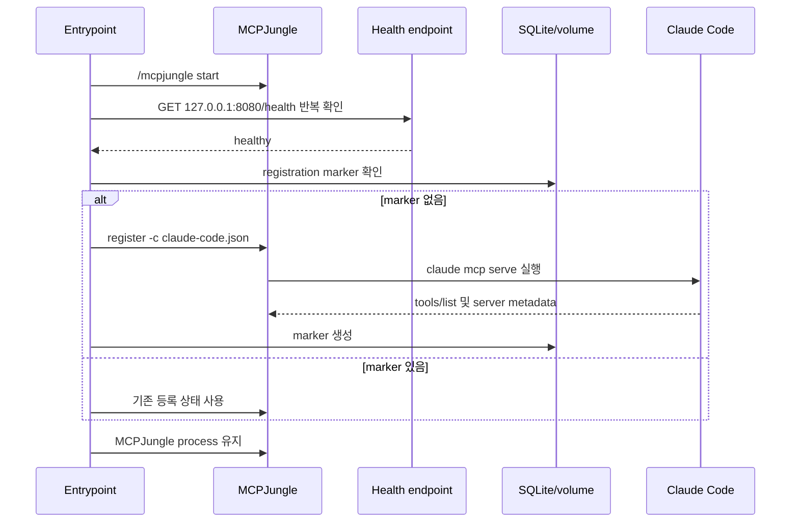

# MCPJungle + Claude Code + Cloudflare Tunnel

## 1. 프로젝트 목적

이 프로젝트는 `cokacremote` 대신 **Claude Code를 MCP server로 노출**하는 구성을 목표로 한다.

외부 MCP client가 MCPJungle의 단일 Streamable HTTP endpoint에 접속하면, MCPJungle가 같은 컨테이너 안에서 `claude mcp serve`를 stdio child process로 실행하고 Claude Code의 도구를 전달한다.

```text
외부 MCP client
  → Cloudflare Tunnel
  → MCPJungle /mcp
  → claude mcp serve
  → Claude Code tools
```

Claude Code 자체의 모델 채팅 API를 제공하는 구성이 아니다. `claude mcp serve`가 제공하는 것은 Claude Code의 파일·검색·셸·편집 등 도구이며, 외부 MCP client가 도구 호출을 판단한다.

## 2. 구현된 구성

```text
mcpjungle service
├─ MCPJungle gateway (:8080)
├─ Claude Code CLI
├─ SQLite database
└─ claude mcp serve (MCPJungle가 stdio로 실행)

cloudflared service
└─ network_mode: service:mcpjungle
```

### 파일

| 파일 | 역할 |
|---|---|
| `docker-compose.yml` | MCPJungle와 cloudflared 서비스 정의 |
| `Dockerfile.mcpjungle-claude` | MCPJungle stdio 이미지에 Claude Code CLI 추가 |
| `mcpjungle-claude-entrypoint` | MCPJungle 시작·health 대기·Claude Code MCP server 등록 |
| `claude-code.json` | `claude mcp serve` stdio 등록 정의 |
| `.env_sample` | 환경변수 예시 파일 |

### 영속 볼륨

```text
mcpjungle-data:
  /var/lib/mcpjungle
  SQLite DB와 Claude Code 등록 marker 보관

claude-code-state:
  /root/.claude
  Claude Code 설정·인증 상태 보관

CLAUDE_CODE_WORKSPACE:
  /workspace
  Claude Code가 작업할 호스트 workspace
```

## 3. 기본 토폴로지

`cloudflared`와 `mcpjungle`은 같은 network namespace를 공유한다. 따라서 cloudflared에서 `localhost:8080`으로 접근하면 mcpjungle 컨테이너의 MCPJungle gateway로 연결된다.



### 네트워크 의미

```yaml
network_mode: "service:mcpjungle"
```

이 설정은 다음을 의미한다.

```text
cloudflared의 localhost:
  mcpjungle와 공유하는 network namespace의 localhost

localhost:8080:
  MCPJungle gateway

호스트 포트 공개:
  현재 Compose에는 없음
```

Cloudflare Tunnel의 public hostname ingress service는 공유 namespace 기준으로 `http://localhost:8080`을 가리키도록 구성해야 한다. Tunnel ingress 설정은 이 Compose 파일이 아니라 Cloudflare Tunnel 설정에서 관리된다.

## 4. Claude Code가 같은 컨테이너에 있는 이유

MCPJungle의 stdio 등록은 `command`와 `args`를 받아 **MCPJungle 프로세스가 로컬 child process를 spawn**하는 방식이다.

```json
{
  "name": "claude-code",
  "transport": "stdio",
  "command": "claude",
  "args": ["mcp", "serve"],
  "env": {
    "HOME": "/root",
    "CLAUDE_CODE_SUBAGENT_MODEL": "haiku"
  }
}
```

`CLAUDE_CODE_SUBAGENT_MODEL=haiku`는 컨테이너 내부에서 MCPJungle가 실행하는 Claude Code child process에만 적용된다. 호스트 단말의 Claude Code나 OpenCode 설정은 변경하지 않는다.

stdio는 네트워크 protocol이 아니라 프로세스의 stdin/stdout file descriptor 연결이다. 따라서 다음 구성은 그대로는 동작하지 않는다.

```text
mcpjungle 컨테이너
claude-code 컨테이너
cloudflared 컨테이너
```

두 컨테이너가 같은 Compose network를 사용해도 다음은 공유되지 않는다.

```text
- 실행 파일 filesystem
- PID namespace
- stdin/stdout pipe
- HOME 및 Claude Code 인증 상태
```

그래서 현재 설계에서는 MCPJungle와 Claude Code를 하나의 custom image에 포함하고, cloudflared만 별도 sidecar로 분리한다.

## 5. 시작 흐름

`mcpjungle-claude-entrypoint`는 다음 순서로 동작한다.



등록 marker:

```text
/var/lib/mcpjungle/.claude-code-registered
```

MCPJungle SQLite와 등록 marker가 같은 named volume에 있기 때문에, 정상적인 재시작에서는 Claude Code 등록을 반복하지 않는다.

## 6. 환경변수

`.env_sample`을 복사해 실제 `.env`를 만들고, 비밀값은 `.env`에만 기록한다.

```env
CLOUDFLARE_TUNNEL_TOKEN=your-cloudflare-tunnel-token
CLAUDE_CODE_WORKSPACE=./workspace
SERVER_MODE=development
OTEL_ENABLED=false
MCP_SERVER_INIT_REQ_TIMEOUT_SEC=10
```

### 주요 값

| 변수 | 기본값 | 설명 |
|---|---|---|
| `CLOUDFLARE_TUNNEL_TOKEN` | 없음 | cloudflared가 Tunnel에 연결할 때 사용하는 token |
| `CLAUDE_CODE_WORKSPACE` | `./workspace` | 호스트 workspace의 Compose 상대경로 |
| `SERVER_MODE` | `development` | MCPJungle 실행 모드 |
| `OTEL_ENABLED` | `false` | OpenTelemetry 활성화 여부 |
| `MCP_SERVER_INIT_REQ_TIMEOUT_SEC` | `10` | upstream MCP server 초기화 timeout |

`CLOUDFLARE_TUNNEL_TOKEN`은 MCP client token이나 Claude Code 인증값이 아니다.

## 7. 사용 방법

### 7.1 환경파일 준비

```bash
cp .env_sample .env
```

`.env`에 실제 Cloudflare Tunnel token을 입력한다. 실제 token은 Git에 커밋하거나 문서에 기록하지 않는다.

### 7.2 이미지 빌드 및 시작

```bash
docker compose build
docker compose up -d
```

`Dockerfile.mcpjungle-claude`는 다음을 수행한다.

```text
- ghcr.io/mcpjungle/mcpjungle:latest-stdio 기반
- Claude Code CLI 설치
- entrypoint 및 claude-code.json 복사
- MCPJungle 실행에 필요한 경로 생성
```

### 7.3 상태 확인

```bash
docker compose ps
docker compose logs --tail=100 mcpjungle
docker compose logs --tail=100 cloudflared
```

컨테이너 내부 health 확인:

```bash
docker compose exec mcpjungle \
  curl -fsS http://127.0.0.1:8080/health
```

MCPJungle의 기본 MCP endpoint:

```text
http://127.0.0.1:8080/mcp
```

Cloudflare Tunnel을 통한 외부 endpoint 예시:

```text
https://mcp.example.com/mcp
```

### 7.4 등록 상태 확인

```bash
docker compose exec mcpjungle \
  /mcpjungle --registry http://127.0.0.1:8080 list servers
```

등록되어야 할 server:

```text
name: claude-code
transport: stdio
command: claude
args: mcp serve
```

## 8. ChatGPT 웹 연결

ChatGPT 웹에서 직접 사용하려면 ChatGPT가 접속할 MCP endpoint는 Cloudflare Tunnel의 public URL이다.

```text
https://mcp.example.com/mcp
```

현재 MCPJungle 기본 설정은 `SERVER_MODE=development`이므로 downstream MCP 인증이 없다. 따라서 ChatGPT 연결 방식은 현재 다음과 같다.

```text
ChatGPT web:
  MCP URL 등록

MCPJungle:
  development mode

인증:
  없음
```

이 구성은 동작 확인용이며, Claude Code의 shell·file·process 도구가 외부에 노출될 수 있으므로 production 인증 구성으로 보지 않는다.

## 9. 선택 구성: Cloudflare MCP Server Portal

ChatGPT 웹에서 표준 OAuth 인증을 사용하려면 Cloudflare MCP Server Portal을 앞단에 추가하는 구성을 검토할 수 있다.

```mermaid
flowchart LR
    ChatGPT["ChatGPT 웹\nMCP Client"]

    subgraph Cloudflare["Cloudflare"]
        Portal["MCP Server Portal\nPortal OAuth endpoint"]
        Agents["Cloudflare Agents Gateway"]
        Edge["Origin hostname Edge"]
        Tunnel["Existing Tunnel"]
    end

    subgraph Origin["Origin Machine"]
        CFd["cloudflared"]
        M["MCPJungle\n/mcp"]
        C["claude mcp serve"]
        T["Claude Code Tools"]
    end

    ChatGPT -->|"OAuth + MCP"| Portal
    Portal --> Agents
    Agents -->|"Portal upstream URL:\nhttps://mcp.example.com/mcp"| Edge
    Edge --> Tunnel
    Tunnel --> CFd
    CFd --> M
    M -->|"stdio"| C
    C --> T
```



### Portal 구성에서 URL 역할

```text
ChatGPT에 등록하는 URL:
  Cloudflare MCP Portal endpoint

Portal upstream URL:
  https://mcp.example.com/mcp

기존 cloudflared:
  계속 Tunnel transport 담당
```

Portal은 기존 Tunnel을 대체하지 않는다. Portal이 기존 public hostname을 HTTP upstream으로 호출하고, 그 hostname 뒤의 Cloudflare Edge가 기존 Tunnel로 전달한다.

Portal은 현재 프로젝트에 구성되어 있지 않으며, Cloudflare account plan·entitlement와 실제 Portal endpoint는 별도로 확인해야 한다.

## 10. 인증 설계 구분

### 현재 development mode

```text
Cloudflare Tunnel token:
  connector 인증

MCPJungle /mcp:
  인증 없음

Claude Code stdio:
  별도 네트워크 인증 없음
```

### OpenCode headless

OpenCode는 remote MCP의 정적 headers를 보낼 수 있으므로 Cloudflare Access Service Token 방식과 결합할 수 있다.

개념 예시:

```json
{
  "mcp": {
    "mcpjungle": {
      "type": "remote",
      "url": "https://mcp.example.com/mcp",
      "enabled": true,
      "headers": {
        "CF-Access-Client-Id": "<CF_ACCESS_CLIENT_ID>",
        "CF-Access-Client-Secret": "<CF_ACCESS_CLIENT_SECRET>"
      }
    }
  }
}
```

### ChatGPT 웹

ChatGPT 웹 custom MCP client에는 임의의 Cloudflare Service Token header를 넣을 수 있다는 근거가 확인되지 않았다. ChatGPT 웹은 다음 순서를 우선 검토한다.

```text
1. Cloudflare MCP Server Portal + OAuth
2. MCP server 자체의 표준 OAuth 2.1
3. 테스트 목적의 no-auth 연결
```

## 11. 현재 미구현·미검증 항목

다음 항목은 이 프로젝트에 아직 구현되거나 실증되지 않았다.

```text
- Cloudflare Access policy
- Cloudflare MCP Server Portal
- Cloudflare Managed OAuth
- ChatGPT 실제 연결
- Cloudflare account plan/entitlement
- Claude Code 무인 인증·토큰 갱신
- production mode 전환
- MCPJungle Enterprise client token과 ACL
- Cloudflare Portal을 통한 Streamable HTTP 장기 연결 안정성
```

또한 `.env_sample`은 예시 파일이며 실제 `.env`가 아니다.

## 12. 운영 시 주의사항

```text
- 실제 Cloudflare Tunnel token을 Git에 커밋하지 않는다.
- claude-code-state volume을 삭제하면 Claude Code 상태가 사라질 수 있다.
- mcpjungle-data volume을 삭제하면 SQLite 등록 정보가 사라질 수 있다.
- cloudflared token은 MCP client 인증값으로 사용하지 않는다.
- MCPJungle development mode를 public production endpoint로 유지하지 않는다.
- `/mcp` 외에 dashboard와 관리 API가 노출되는지 별도로 확인한다.
- Docker socket을 MCPJungle/Claude Code 컨테이너에 마운트하지 않는다.
- Claude Code 도구가 파일·셸·프로세스 권한을 제공한다는 점을 전제로 endpoint를 공개한다.
```

## 13. 공식 참고자료

- [MCPJungle](https://github.com/mcpjungle/MCPJungle)
- [MCPJungle Docker Compose](https://raw.githubusercontent.com/mcpjungle/MCPJungle/main/docker-compose.yaml)
- [MCPJungle stdio Dockerfile](https://raw.githubusercontent.com/mcpjungle/MCPJungle/main/stdio.Dockerfile)
- [Claude Code MCP server](https://code.claude.com/docs/en/mcp.md)
- [Cloudflare Secure MCP servers](https://developers.cloudflare.com/cloudflare-one/access-controls/ai-controls/secure-mcp-servers/)
- [Cloudflare MCP server portals](https://developers.cloudflare.com/cloudflare-one/access-controls/ai-controls/mcp-portals/)
- [Cloudflare Authenticate coding agents](https://developers.cloudflare.com/cloudflare-one/access-controls/authenticate-agents/)
- [OpenAI MCP authentication](https://developers.openai.com/plugins/build/auth)
